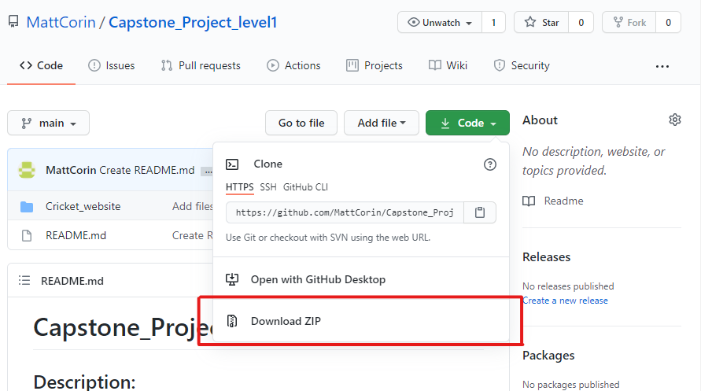
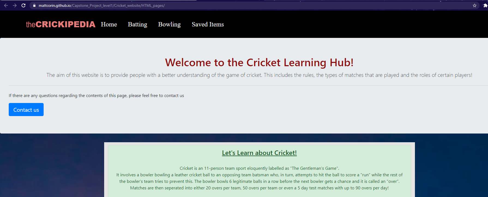
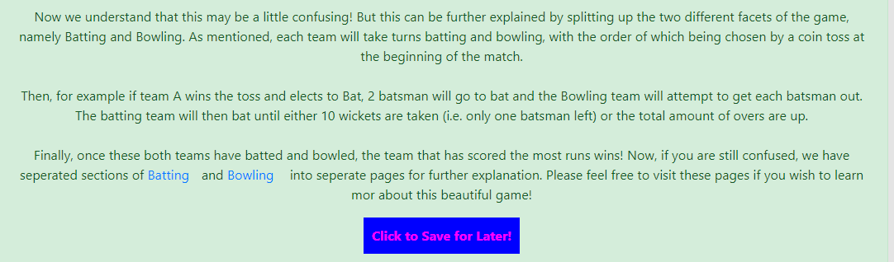
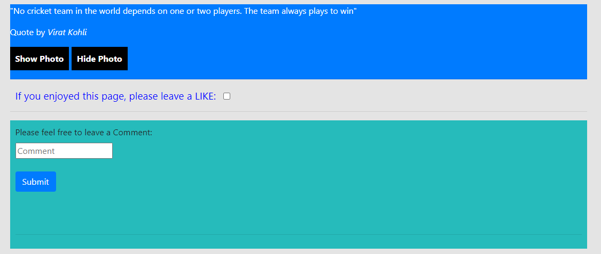

# Capstone_Project_level1

## Description:
A website that explains the game of cricket, particularly referencing how to play the sport and its rules. Visual aids are used to indicate how the sport is played and what the players do during the course of a match.

## Table of Content
1. Installation
2. Usage
3. Credits

## 1. Installation
The files can be downloaded from my personal GitHub repository at https://github.com/MattCorin/Capstone_Project_level1. 
Under the green "Code" dropdown, the files can be downloaded by clicking Download Zip as indicated in the image below:
  

 
Once these files are downloaded, they must then be extracted to a folder of your choice on your computer by right-clicking on the downloaded zip folder and clicking "Extract All...". 
  
Once extracted, the website can be used on your local machine! Simply navigate inside the "Criceket_website" folder, and within the "HTML_pages" folder, double-click on the "index.html" file to open the home page.

 

## 2. Usage
The website can be found at https://mattcorin.github.io/Capstone_Project_level1/Cricket_website/HTML_pages/. This will navigate you to the home page, which looks like the following:
  

 
Indicated above is the first portion of functionality, the Contact Us page. Clicking this button will take you to a page that will allow you to contact the website owners and leave them a message. Scrolling down the home page, you will find a Click to Save for Later! button as indicated in the image below. Clicking this will allow you to save that protion of the website to a seperate page that can be navigated to by clicking on the Saved Items panel shown in the home page image above. A similar button is found on the Batting and Bowling pages for the same purpose.
  

 
Finally at the bottom of the home page, we have hide/show buttons for a animated photo, a like feature and a Comments section as shown in the image below.
  

 

## 3. Credits
Credit must be given to my HyperionDev mentor, Dayle Klinkhamer (Forgemaster132), who assisted majorly throughout the course of this website creation.  
